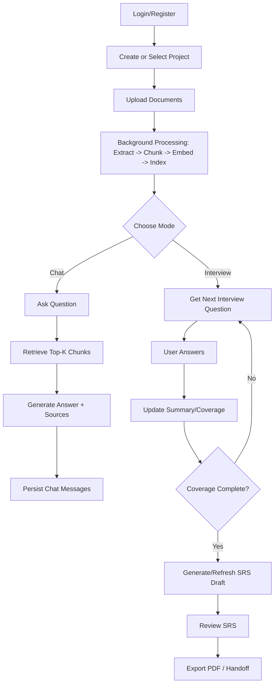
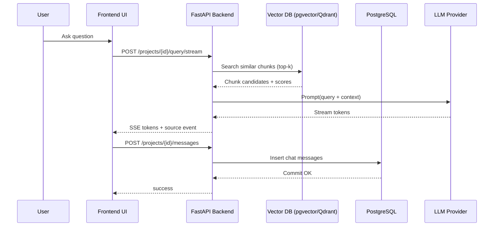
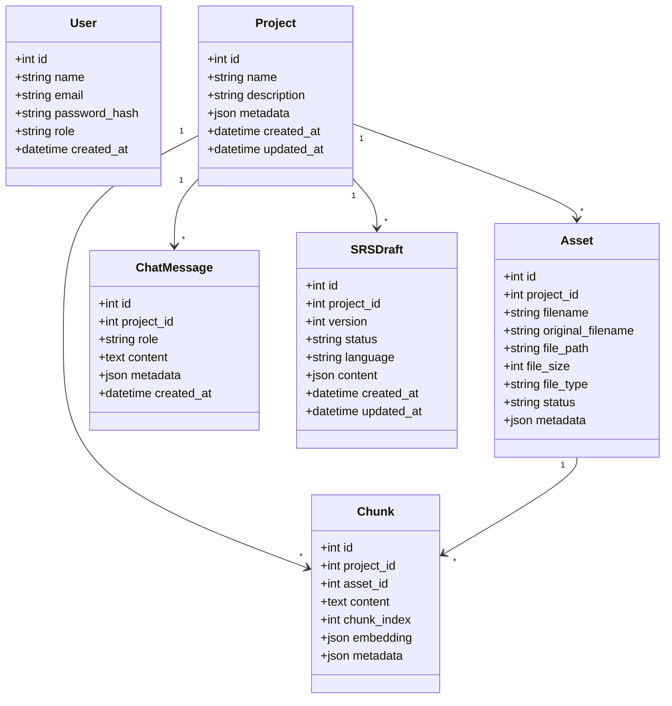
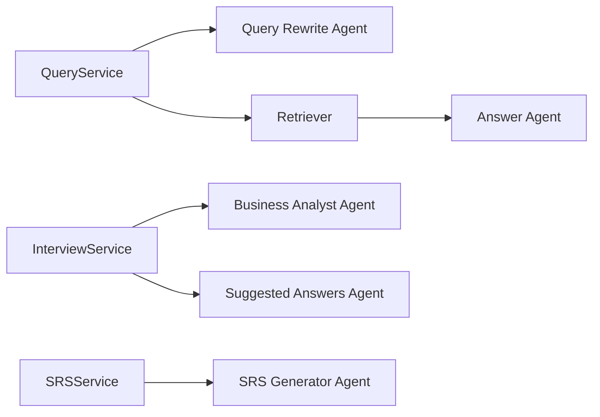

# RAGMind — Full Technical Autopsy & Master Documentation

> Version: February 2026  
> Scope: Backend + Frontend + Runtime Logic + UX + Agentic Prompting

---

## تقرير العيوب والنواقص

### 1) Business Logic Roast (Brutal, because it is deserved)

- The product promise says “document-grounded RAG”, but the runtime has a **no-context fallback** that answers from general model knowledge when no chunks are found. That is a trust-risk unless explicitly surfaced every time.
- Interview flow is ambitious (coverage, contradiction detection, cumulative summary), but it relies on strict JSON compliance from LLM output. You have parser fallback, yes, but the contract is still fragile and can silently drift.
- Project ownership is the biggest red flag: many core routes are not scoped by user identity. This is not a “nice-to-have” bug; this is an access model gap.
- Error handling frequently returns `detail=str(e)` from internal exceptions. Congratulations, now your API can leak internals by design.
- You are mixing deterministic workflow and probabilistic LLM logic without hard guardrails (state machine constraints, validation schemas, retry policy by failure type).

### 2) UI/UX Roast

- Frontend behavior is concentrated in a single oversized file (`frontend/app.js` ~3.5k lines). This is not maintainability; this is operational debt with syntax highlighting.
- The app has multiple advanced modes (chat, interview, SRS, config), but information architecture still feels mode-switch heavy and context-fragile.
- UX consistency suffered from repeated stylesheet resets (`git checkout -- frontend/style.css`) — your process currently allows accidental regression of critical interaction design.
- Accessibility is visibly under-engineered (ARIA, labels, semantic controls warnings are present).
- The product tries to be enterprise-grade while key UX states still depend on brittle DOM event chains.

### 3) Architecture Roast

- This is a **modular monolith**, not microservices. That is fine, but call it what it is.
- Separation between routes/controllers/services exists, but authentication/authorization boundaries are inconsistent across endpoints.
- Runtime provider switching is strong, but provider abstraction does not eliminate failure-mode complexity (token limits, malformed model output, stream interruption).
- Security defaults are too permissive for any serious deployment (`allow_origins=["*"]`, weak default JWT secret).

### Missing Information (and yes, this is a problem)

You did not provide explicit SLAs, target throughput, expected tenant model, or compliance constraints. Without these, architecture decisions cannot be validated beyond “works on my machine”. For a production-grade system, this is unacceptable ambiguity.

---

## 1. Project Overview & Business Logic

### What the project is

RAGMind is an AI-assisted requirements platform that combines:

1. Document ingestion + chunking + vector indexing
2. Retrieval-Augmented Q&A (regular and streaming)
3. Guided requirements interview (business-analyst style)
4. SRS draft generation + PDF export

### Value Proposition

- Converts unstructured project documents into queryable knowledge.
- Helps teams gather requirements with structured interview guidance.
- Produces a draft SRS artifact directly from conversation evidence.

### Core Business Flow (Input → Output)

1. User creates project.
2. User uploads documents.
3. Backend extracts text, chunks content, generates embeddings, stores vectors.
4. User asks question.
5. Backend retrieves top-k chunks and generates answer with citations.
6. User can run guided interview mode for structured requirement elicitation.
7. Backend generates SRS draft from message history.
8. User exports PDF and hands off to engineering.

---

## 2. Architecture & Tech Stack

### Architecture Pattern

**Pattern:** Modular Monolith (Layered)

**Why this classification is accurate:**

- Single deployable FastAPI app.
- Clear route/controller/service structure.
- Shared database and shared runtime configuration.
- No independent service boundaries, no service mesh, no async choreography between deployable units.

### Backend

- **Language:** Python
- **Framework:** FastAPI
- **ORM:** SQLAlchemy Async
- **Database:** PostgreSQL (+ pgvector extension)
- **Optional Vector DB:** Qdrant
- **Auth:** JWT + bcrypt
- **LLM/Embedding Providers:** Gemini, OpenRouter, Groq, Cerebras, Cohere, Voyage, HF (config-driven)
- **PDF:** fpdf2

**Rationale for DB stack:**

- PostgreSQL gives transactional persistence for business entities.
- pgvector/Qdrant gives semantic retrieval capability for RAG use cases.

### Frontend

- **Stack:** Vanilla HTML/CSS/JavaScript (no bundler)
- **State management:** In-file app state object + imperative DOM updates (`frontend/app.js`)
- **Strength:** zero-build simplicity.
- **Tradeoff:** growing complexity and weaker long-term maintainability.

### System Boundaries

- **Backend:** API orchestration, retrieval, prompt orchestration, persistence.
- **Frontend:** rendering, interaction, local cache helpers, route/view switching.
- **Current gap:** access-control enforcement is not uniformly applied across core routes.

---

## 3. Software Engineering Diagrams (Mermaid.js)

### A) Activity Diagram — End-to-End User Journey



### B) Sequence Diagram — User → UI → Backend → Database



### C) Class Diagram (Conceptual Core Entities)



### D) Agents Diagram (Prompted Components)



---

## 4. UI/UX Philosophy

### Design System (as implemented)

- Warm-neutral palette in light mode, high-contrast dark mode override.
- Accent-driven identity (`--accent-primary`, `--accent-secondary`).
- Mixed modern typography (`Space Grotesk` + `IBM Plex Sans Arabic`).
- Visual style: semi-glass cards + rounded components + soft shadows.

### UX Decisions

- Sidebar-first navigation: optimized for feature-rich desktop flow.
- Chat-first interaction model with optional interview mode for structured elicitation.
- Live draft mentality: users iterate between discussion and SRS refinement.
- Persona target: business analyst / product owner / technical founder working in Arabic or English.

### UX Risks

- Single-page imperative DOM logic increases regression likelihood.
- Accessibility quality is currently below enterprise expectations.
- Dense feature set can overload first-time users without stronger progressive disclosure.

---

## 5. Installation & Setup

### Prerequisites

- Python 3.8+
- `uv` package manager
- Docker Desktop (recommended)
- API keys (at minimum: Gemini)

### Local Development (Windows)

```powershell
git clone <repo-url>
cd RAGMind---EELU-Project
.\setup.bat
```

Then run:

```powershell
.\start_backend.bat
```

Services expected:

- Frontend: `http://localhost:3000`
- Backend: `http://127.0.0.1:8500`
- API Docs: `http://127.0.0.1:8500/docs`

### Docker Services

`docker-compose.yml` provisions:

- PostgreSQL (pgvector image) on host port `5555`
- Qdrant on ports `6333/6334`

### Required Environment Variables (minimum)

- `DATABASE_URL`
- `GEMINI_API_KEY`
- `JWT_SECRET` (must be changed for any non-local environment)

---

## 6. Agent Inventory (How Many, Prompts, and How They Deal)

### Agent Count (effective prompted components): **6**

1. **RAG Answer Agent (AR/EN)**  
   - Source: `backend/services/answer_service.py`  
   - Prompt style: strict context-grounded answering with inline source citations.

2. **No-Context Fallback Agent (AR/EN)**  
   - Source: `backend/services/answer_service.py`  
   - Prompt style: general-knowledge mode when no chunks are available.

3. **Query Rewrite Agent**  
   - Source: `backend/services/query_service.py`  
   - Prompt style: retrieval-optimization rewrite, keep intent and language.

4. **Interview Business Analyst Agent (AR/EN)**  
   - Source: `backend/services/interview_service.py`  
   - Prompt style: validates answers, detects contradiction, tracks 5 coverage areas, outputs JSON only.

5. **Interview Suggested Answers Agent (AR/EN)**  
   - Source: `backend/services/interview_service.py`  
   - Prompt style: generates 3–5 candidate answers for current interview question.

6. **SRS Generator Agent (AR/EN)**  
   - Source: `backend/services/srs_service.py`  
   - Prompt style: converts conversation to structured SRS JSON (`summary/metrics/sections/questions/next_steps`).

### How They Deal (Orchestration Logic)

- Query pipeline: Rewrite (optional) → Embed → Retrieve → Answer (or fallback).
- Interview pipeline: Build conversation window → BA prompt → parse JSON → enforce cumulative merge → generate suggested answers.
- SRS pipeline: Read full chat history → generate JSON draft → persist versioned draft → export PDF.
- Provider execution: All agents route through provider factory abstractions, enabling runtime model switching.

### Hard Truth About Current Agent Reliability

- Prompt engineering is advanced, but parser resilience still depends on model compliance.
- There is no strict schema validator layer with recovery strategy per agent output type.
- “Agentic” behavior is mostly prompt orchestration, not tool-using autonomous planning.

---

## 7. Technical Debt Register (Priority Order)

1. **P0 — Access control model:** scope all project/document/message routes to authenticated user ownership.
2. **P0 — Security defaults:** remove wildcard CORS and enforce production-safe config profiles.
3. **P1 — Frontend modularization:** split `app.js` into feature modules + state store abstraction.
4. **P1 — API error hygiene:** replace raw exception leakage with typed error contracts.
5. **P1 — Agent output contracts:** add strict JSON schema validation + retry/fallback policy.
6. **P2 — Observability:** structured tracing around retrieval quality, prompt latency, and parsing failures.
7. **P2 — Accessibility:** semantic controls, labels, keyboard navigation parity, ARIA correctness.

---

## 8. Final Verdict

This project is **high-potential but under-governed**. You built serious capabilities (RAG + interview + SRS) in one system, but governance controls (authz, modularity, reliability contracts) are lagging.  
In enterprise terms: impressive prototype velocity, not yet production discipline.
